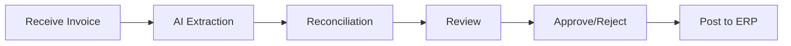

## Overview

SubBase streamlines invoice processing by automatically extracting data from vendor invoices, matching them to purchase orders, and routing them for approval. This guide covers the complete invoice workflow from receipt to approval.

---

## The Invoice Workflow

---

## Step 1: Receiving Invoices

Invoices can enter SubBase in several ways:

### Invoice Inbox (Recommended)

The **Invoice Inbox** automatically captures invoices sent to your company's SubBase email address:

1. Vendors email invoices to your dedicated SubBase inbox
2. PDFs are automatically extracted using AI/OCR
3. Invoice data appears ready for reconciliation

<Tip>
Share your SubBase invoice email address with vendors to streamline invoice receipt.
</Tip>

### Manual Upload

To upload an invoice manually:

<Steps>
  <Step title="Go to Invoices">
    Navigate to **Invoices** from the main menu.
  </Step>
  <Step title="Click Upload">
    Click **Upload Invoice** and select the PDF file.
  </Step>
  <Step title="Select Vendor">
    Choose the vendor this invoice is from.
  </Step>
  <Step title="Process">
    SubBase extracts the invoice data automatically.
  </Step>
</Steps>

---

## Step 2: AI-Powered Extraction

When an invoice is received, SubBase's AI automatically extracts:

- **Invoice Number** – The vendor's invoice identifier
- **Invoice Date** – When the invoice was issued
- **Due Date** – Payment due date
- **Total Amount** – The invoice total
- **Line Items** – Individual charges with descriptions and amounts

### Reviewing Extracted Data

After extraction:

1. Open the invoice to review extracted data
2. Verify the invoice number, dates, and amounts
3. Correct any extraction errors
4. Line items are highlighted for matching

<Warning>
Always verify extracted data before approving. AI extraction is highly accurate but not perfect.
</Warning>

---

## Step 3: Invoice Reconciliation

Reconciliation matches invoice line items to your purchase orders and deliveries. This ensures you're only paying for what you ordered and received.

### Automatic Matching

SubBase attempts to match invoices automatically:

- Matches by PO number if included on invoice
- Matches line items to order materials
- Highlights discrepancies for review

### Manual Matching

For invoices that don't auto-match:

<Steps>
  <Step title="Select Purchase Order">
    Choose the PO this invoice relates to from the dropdown.
  </Step>
  <Step title="Match Line Items">
    Link each invoice line to the corresponding order material.
  </Step>
  <Step title="Verify Quantities">
    Ensure invoiced quantities match what was delivered.
  </Step>
  <Step title="Check Pricing">
    Confirm unit prices match the purchase order.
  </Step>
</Steps>

### Handling Discrepancies

Common discrepancies and how to handle them:

| Discrepancy | Action |
|-------------|--------|
| **Price differs from PO** | Review and approve if valid, or flag for vendor discussion |
| **Quantity exceeds PO** | Verify delivery records before approving overage |
| **Unknown materials** | Match to PO manually or create as non-PO invoice |
| **Missing PO reference** | Search for matching PO by vendor and date range |

---

## Step 4: Review and Approve

Once reconciled, invoices move through your approval workflow:

### Invoice States

| State | Description |
|-------|-------------|
| **Unreviewed** | Invoice received, awaiting review |
| **Approved** | Verified and ready for payment |
| **Rejected** | Invoice disputed or incorrect |
| **Posted** | Synced to accounting system (ERP) |

### Approving an Invoice

<Steps>
  <Step title="Review Details">
    Verify vendor, amounts, and all matched line items.
  </Step>
  <Step title="Check Attachments">
    Ensure supporting documents (delivery tickets, etc.) are attached.
  </Step>
  <Step title="Approve">
    Click **Approve** to mark the invoice ready for payment.
  </Step>
</Steps>

### Rejecting an Invoice

If an invoice has issues:

1. Click **Reject**
2. Add a reason for rejection
3. The invoice is flagged for follow-up with the vendor

---

## Step 5: Posting to ERP

If your company uses an ERP integration (QuickBooks, Sage, Foundation, etc.):

<Steps>
  <Step title="Approved Invoices Queue">
    Approved invoices appear in the posting queue.
  </Step>
  <Step title="Review for Posting">
    Verify cost codes and GL accounts are correct.
  </Step>
  <Step title="Post">
    Click **Post to ERP** to sync the invoice to your accounting system.
  </Step>
</Steps>

The invoice status changes to **Posted** once successfully synced.

---

## Invoice Inbox Management

### Filtering Invoices

Use filters to find invoices quickly:

- **Status** – Filter by Unreviewed, Approved, Rejected, Posted
- **Vendor** – Show invoices from a specific vendor
- **Project** – Filter by project
- **Date Range** – Invoices received within a period
- **Amount** – Filter by invoice amount

### Bulk Actions

For efficiency, you can:

- Select multiple invoices for batch approval
- Assign invoices to team members for review
- Export invoice lists to CSV

---

## Best Practices

<CardGroup cols={2}>
  <Card title="Review Daily" icon="calendar-check">
    Process invoices regularly to avoid backlogs and late payments.
  </Card>
  <Card title="Match to POs" icon="link">
    Always reconcile invoices to purchase orders for accurate cost tracking.
  </Card>
  <Card title="Verify Before Approving" icon="check-double">
    Double-check extracted data and pricing before approval.
  </Card>
  <Card title="Attach Documentation" icon="paperclip">
    Link delivery tickets and other supporting docs to invoices.
  </Card>
</CardGroup>

---

## Related Guides

<Card title="Creating a Purchase Order" icon="file-invoice-dollar" href="/guides/procurement/creating-purchase-orders">
  Create orders that invoices will be matched against.
</Card>

<Card title="Tracking Deliveries" icon="truck" href="/guides/deliveries/tracking-deliveries">
  Receive deliveries to support invoice verification.
</Card>

<Card title="ERP Integrations" icon="plug" href="/guides/setup/order-flows">
  Configure invoice syncing with your accounting system.
</Card>
