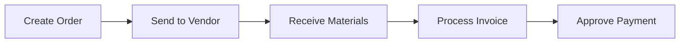

## Welcome to SubBase

This quickstart guide will help you understand the core workflows in SubBase and get you productive quickly. Whether you're creating your first purchase order or processing invoices, this guide covers the essentials.

---

## Your First Steps

<Steps>
  <Step title="Set Up Your Materials">
    Before placing orders, set up your Material Database with commonly used items.
    
    [Setting Up Materials →](/guides/setup/material-database)
  </Step>
  <Step title="Add Your Vendors">
    Add the vendors you order from, including contacts and pricing.
    
    [Managing Vendors →](/guides/setup/vendor-management)
  </Step>
  <Step title="Create Your First Order">
    Create and send a purchase order to a vendor.
    
    [Creating Purchase Orders →](/guides/procurement/creating-purchase-orders)
  </Step>
  <Step title="Track Deliveries">
    Monitor when materials arrive and confirm receipt.
    
    [Tracking Deliveries →](/guides/deliveries/tracking-deliveries)
  </Step>
  <Step title="Process Invoices">
    Match vendor invoices to your orders and approve for payment.
    
    [Processing Invoices →](/guides/invoices/processing-invoices)
  </Step>
</Steps>

---

## Core Workflows

### Procurement

The typical procurement workflow in SubBase:

<CardGroup cols={2}>
  <Card title="Purchase Orders" icon="file-invoice-dollar" href="/guides/procurement/creating-purchase-orders">
    Create and manage orders to vendors.
  </Card>
  <Card title="Request for Quote" icon="file-signature" href="/guides/procurement/request-for-quote">
    Get pricing before committing to an order.
  </Card>
</CardGroup>

### Inventory

If you maintain warehouse stock:

<CardGroup cols={2}>
  <Card title="Warehouse Inventory" icon="warehouse" href="/guides/inventory/managing-inventory">
    Track what you have in stock.
  </Card>
  <Card title="Inventory Requests" icon="hand-holding-box" href="/guides/inventory/inventory-requests">
    Request materials from internal stock.
  </Card>
</CardGroup>

### Commitments

For long-term vendor agreements:

<CardGroup cols={2}>
  <Card title="Material Commitments" icon="file-contract" href="/guides/commitments/material-commitments">
    Track orders against negotiated pricing.
  </Card>
  <Card title="Concrete Pours" icon="truck-ramp-box" href="/guides/commitments/concrete-commitments">
    Schedule and manage concrete work.
  </Card>
</CardGroup>

---

## Key Concepts

Before diving in, understand these core terms:

| Term | What It Means |
|------|--------------|
| **Project** | A construction job or site where work is performed |
| **Purchase Order (PO)** | A formal order sent to a vendor |
| **Delivery** | A scheduled shipment of materials |
| **Commitment** | A long-term agreement with a vendor |
| **Cost Code** | An accounting code for categorizing spend |

[View Complete Terminology →](/_inputs/terminology)

---

## Getting Help

<CardGroup cols={2}>
  <Card title="Browse All Guides" icon="book-open" href="/guides/procurement/creating-purchase-orders">
    Explore our complete guide library.
  </Card>
  <Card title="Contact Support" icon="headset" href="mailto:support@subbase.io">
    Reach out to our support team.
  </Card>
</CardGroup>
